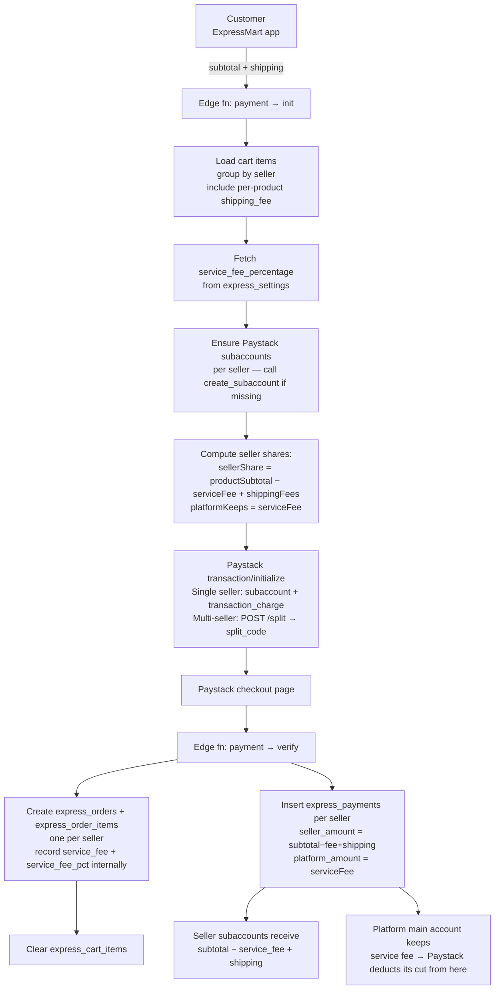

## Payment Flow (Paystack, multi-vendor)

This document explains how payments are initialized, split to seller subaccounts, verified, and recorded.

---

### Core Principle

> **The service fee is NOT charged to customers. It is deducted from each seller's subaccount share internally by Paystack.**

- **Customer pays:** `product_subtotal + shipping_fees` — nothing more.
- **Seller receives:** `product_subtotal − service_fee + shipping_fees`
- **Platform keeps:** `service_fee` (percentage of product subtotal, set by admin)
- **Paystack deducts:** its processing fee from the platform's share (`bearer = account`)

This means the platform's service fee absorbs all Paystack processing costs. Sellers receive their full product revenue minus only the platform commission.

---

### Flow Diagram



---

### Roles

| App / Service                   | Role                                                                              |
| ------------------------------- | --------------------------------------------------------------------------------- |
| **ExpressMart**                 | Customer app — holds cart, shows subtotal+shipping total, initiates payment       |
| **Express-Store**               | Seller app — sets product prices, per-product shipping_fee; views net earnings    |
| **ExpressMartAdmin**            | Admin app — sets `service_fee_percentage` in `express_settings`                   |
| **Edge fn `payment`**           | Initializes Paystack transaction with correct splits; verifies and records orders |
| **Edge fn `create_subaccount`** | Creates Paystack subaccounts and updates seller records                           |
| **Paystack**                    | Processes payment; distributes to subaccounts; charges its fee to main account    |
| **Supabase**                    | Persists products, orders, items, payment ledger rows, and global settings        |

---

### Fee Structure

| Fee                         | Who sets it           | Who pays it                                            | Who receives it             |
| --------------------------- | --------------------- | ------------------------------------------------------ | --------------------------- |
| **Product price**           | Seller                | Customer                                               | Seller subaccount           |
| **Shipping fee**            | Seller (per product)  | Customer                                               | Seller subaccount           |
| **Service fee**             | Admin (% of subtotal) | **Deducted from seller's share**                       | Platform main Paystack acct |
| **Paystack processing fee** | Paystack              | Platform (absorbed from service fee, `bearer=account`) | Paystack                    |

> The customer is never shown or charged the service fee. It is an internal deduction from the seller's payout.

---

### Initialization (`payment` → `action: initialize-payment`)

1. Load cart items for the authenticated user and group by `seller_id`.
2. Fetch `service_fee_percentage` from `express_settings`.
3. Ensure each seller has a Paystack subaccount; if missing, call `create_subaccount` to create one.
4. Compute per-seller totals:
   - `productSubtotal`: sum of `item.price × quantity` for this seller.
   - `shippingFee`: sum of `product.shipping_fee × quantity` for this seller.
   - `serviceFee = service_fee_percentage% × productSubtotal`.
   - `sellerShare (pesewas) = (productSubtotal − serviceFee + shippingFee) × 100`.
5. `totalAmount (pesewas) = (productSubtotal + shippingFee) × 100` — **no service fee added to customer total**.
6. Build Paystack init payload:
   - **Single seller:** `subaccount`, `transaction_charge = totalAmount − sellerShare` (platform gets the difference), `bearer = account`.
   - **Multi-seller:** create split via `POST /split` with `subaccounts: [{ subaccount, share: sellerShare }]`, `bearer_type = account`; pass `split_code` to `transaction/initialize`.

---

### Verification and Recording (`payment` → default action)

1. Verify Paystack reference via `GET /transaction/verify/{reference}`.
2. Re-fetch cart items; hydrate missing products from `express_products` if needed.
3. Recompute groups per seller and re-fetch `service_fee_percentage` from settings.
4. For each seller group, insert an `express_orders` record:
   - `subtotal`: product subtotal for this seller.
   - `shipping_fee`: shipping fees for this seller's products.
   - `service_fee`: platform fee deducted (% of subtotal). Stored for reporting only — not in customer-facing total.
   - `service_fee_pct`: the percentage used.
   - `total = subtotal + shipping_fee` (customer-facing; no service fee).
5. Insert `express_order_items` for each product in the seller group.
6. Insert `express_payments` per seller:
   - `seller_amount = subtotal − service_fee + shipping_fee` (what seller actually receives).
   - `platform_amount = service_fee` (what platform retains; Paystack fee deducted from this).
   - `paystack_fee_pesewas`: allocated Paystack processing fee in pesewas.
7. Update order with raw `payment_data` from Paystack. Clear `express_cart_items`.

---

### Money Movement Summary

| Who      | Receives                                             |
| -------- | ---------------------------------------------------- |
| Customer | Debited `subtotal + shipping_fees`                   |
| Seller   | `subtotal − service_fee + shipping_fees` per seller  |
| Platform | All `service_fees` across sellers in the transaction |
| Paystack | Processing fee, deducted from main account share     |

**Example** (5% service fee, single seller, GH₵100 product + GH₵10 shipping):

|                                      | Amount (GHS)                           |
| ------------------------------------ | -------------------------------------- |
| Customer pays                        | 110.00                                 |
| Service fee (5% × 100)               | 5.00 (internal, not added to customer) |
| Seller receives                      | 105.00 (= 100 − 5 + 10)                |
| Platform keeps (before Paystack fee) | 5.00                                   |
| Paystack processing fee (~)          | ~1.50 (from platform's share)          |
| Platform net                         | ~3.50                                  |

---

### Store App — Seller View

- Product creation: seller sets `price` and optional `shipping_fee` per product.
- Live preview shown when entering price: **Platform fee (X%)** and **You receive (net)**.
- Discount applied to display price does **not** reduce the service fee (fee is on full `price`).
- Order Detail screen shows: Product Subtotal + Shipping − Platform Service Fee = **Net You Receive**.

### Admin App

- `SettingsScreen` → "Service Fee Percentage (%)" drives all fee calculations globally.
- Stored in `express_settings` as `key = service_fee_percentage`.

### Customer App — ExpressMart

- Cart shows item subtotal only, with a note "Shipping & service fees calculated at checkout".
- Checkout shows: subtotal + shipping fees = total. **No service fee line shown.**
- Service fee computation is entirely transparent to customers.

---

### Database Touchpoints

| Table                 | Relevant columns                                                                 |
| --------------------- | -------------------------------------------------------------------------------- |
| `express_settings`    | `service_fee_percentage` (global)                                                |
| `express_products`    | `shipping_fee`, `price`                                                          |
| `express_sellers`     | `payment_account` (Paystack subaccount code)                                     |
| `express_orders`      | `subtotal`, `shipping_fee`, `service_fee`, `service_fee_pct`, `total`            |
| `express_order_items` | `price`, `quantity`, `shipping_fee`, `total`                                     |
| `express_payments`    | `seller_amount`, `platform_amount`, `service_fee_amount`, `paystack_fee_pesewas` |
| `express_cart_items`  | Cleared after successful verification                                            |

---

### Environment / Config Required

| Variable                    | Used for                                           |
| --------------------------- | -------------------------------------------------- |
| `PAYSTACK_SECRET_KEY`       | All Paystack API calls                             |
| `SUPABASE_URL`              | Supabase client and `create_subaccount` invocation |
| `SUPABASE_ANON_KEY`         | Authenticated Supabase client                      |
| `SUPABASE_SERVICE_ROLE_KEY` | Privileged writes (bypasses RLS for order inserts) |

---

### Operational Notes

- If any seller lacks a Paystack subaccount during init, the flow **fails fast** with an explicit error.
- `bearer = account` ensures Paystack processing fees are charged to the main account (platform), never to sellers.
- All amounts sent to Paystack are in **minor units (pesewas)**. DB amounts are in **major units (GHS)** except fields explicitly noted as pesewas.
- For multi-seller orders, each seller's share is computed individually. The platform retains the sum of all service fees as the difference between `totalAmount` and `sum(sellerShares)`.
- Service fee is stored on each order for internal audit/reporting even though it is invisible to customers.

```mermaid
